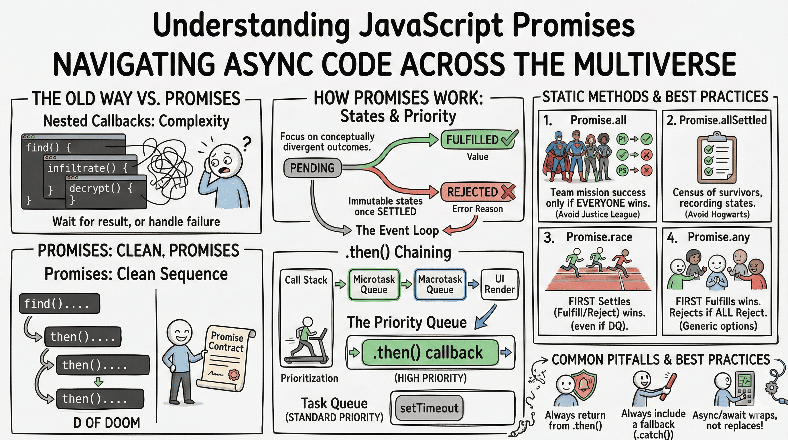
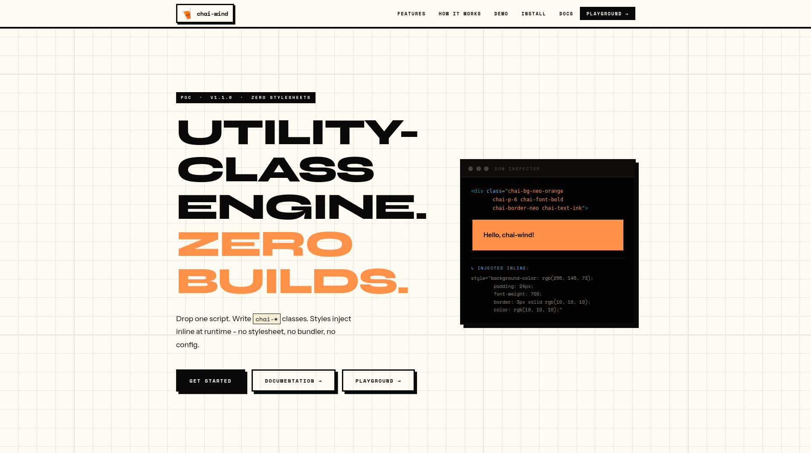

<a href="https://blog.atharvdangedev.in">
  <h1 align="center">Blogs</h1>
</a>

  Showcase of all the learning I did through reading, understanding and writing the blogs for future devs.

  
  
  
  

### [Git Fundamentals: A Deep Dive into Version Control](https://blog.atharvdangedev.in/posts/git-fundamentals-a-deep-dive-into-version-control)

  <a href="https://blog.atharvdangedev.in/posts/git-fundamentals-a-deep-dive-into-version-control">
      

      
    

  </a>

 

### [Git for Beginners: Basics and Essential Commands](https://blog.atharvdangedev.in/posts/git-for-beginners-basics-and-essential-commands)

  <a href="https://blog.atharvdangedev.in/posts/git-for-beginners-basics-and-essential-commands">
      

      
    

  </a>

 

### [Inside Git: How It Works and the Role of the .git Folder](https://blog.atharvdangedev.in/posts/inside-git-how-it-works-and-the-role-of-the-git-folder)

  <a href="https://blog.atharvdangedev.in/posts/inside-git-how-it-works-and-the-role-of-the-git-folder">
      

      
    

  </a>

 

### [Why Version Control Exists: The Pendrive Problem](https://blog.atharvdangedev.in/posts/why-version-control-exists-the-pendrive-problem)

  <a href="https://blog.atharvdangedev.in/posts/why-version-control-exists-the-pendrive-problem">
      

      
    

  </a>

 

### [Understanding Network Devices: The Journey from Internet to Your Application](https://blog.atharvdangedev.in/posts/understanding-network-devices-the-journey-from-internet-to-your-application)

  <a href="https://blog.atharvdangedev.in/posts/understanding-network-devices-the-journey-from-internet-to-your-application">
      

      
    

  </a>

 

### [Talking to Machines: A Complete Guide to cURL for Beginners](https://blog.atharvdangedev.in/posts/talking-to-machines-a-complete-guide-to-curl-for-beginners)

  <a href="https://blog.atharvdangedev.in/posts/talking-to-machines-a-complete-guide-to-curl-for-beginners">
      

      
    

  </a>

 

### [How the Internet Remembers Addresses: Understanding DNS Record Types](https://blog.atharvdangedev.in/posts/how-the-internet-remembers-addresses-understanding-dns-record-types)

  <a href="https://blog.atharvdangedev.in/posts/how-the-internet-remembers-addresses-understanding-dns-record-types">
      

      
    

  </a>

 

### [How DNS Resolution Works: Understanding the Internet's Phonebook](https://blog.atharvdangedev.in/posts/how-dns-resolution-works-understanding-the-internets-phonebook)

  <a href="https://blog.atharvdangedev.in/posts/how-dns-resolution-works-understanding-the-internets-phonebook">
      

      
    

  </a>

 

### [TCP 3-Way Handshake & Reliable Communication Explained](https://blog.atharvdangedev.in/posts/tcp-3-way-handshake-reliable-communication-explained)

  <a href="https://blog.atharvdangedev.in/posts/tcp-3-way-handshake-reliable-communication-explained">
      

      
    

  </a>

 

### [TCP vs UDP: When to Use What, and How TCP Relates to HTTP](https://blog.atharvdangedev.in/posts/tcp-vs-udp-when-to-use-what-and-how-tcp-relates-to-http)

  <a href="https://blog.atharvdangedev.in/posts/tcp-vs-udp-when-to-use-what-and-how-tcp-relates-to-http">
      

      
    

  </a>

 

### [How a Browser Works: A Beginner-Friendly Guide to Browser Internals](https://blog.atharvdangedev.in/posts/how-a-browser-works-a-beginner-friendly-guide-to-browser-internals)

  <a href="https://blog.atharvdangedev.in/posts/how-a-browser-works-a-beginner-friendly-guide-to-browser-internals">
      

      
    

  </a>

 

### [Understanding HTML Tags and Elements](https://blog.atharvdangedev.in/posts/understanding-html-tags-and-elements)

  <a href="https://blog.atharvdangedev.in/posts/understanding-html-tags-and-elements">
      

      
    

  </a>

 

### [Emmet for HTML: A Beginner's Guide to Writing Faster Markup](https://blog.atharvdangedev.in/posts/emmet-for-html-a-beginners-guide-to-writing-faster-markup)

  <a href="https://blog.atharvdangedev.in/posts/emmet-for-html-a-beginners-guide-to-writing-faster-markup">
      

      
    

  </a>

 

### [CSS Selectors 101: Targeting Elements with Precision](https://blog.atharvdangedev.in/posts/css-selectors-101-targeting-elements-with-precision)

  <a href="https://blog.atharvdangedev.in/posts/css-selectors-101-targeting-elements-with-precision">
      

      
    

  </a>

 

### [JavaScript Engines: A Quick Tour Through V8, SpiderMonkey, and Beyond](https://blog.atharvdangedev.in/posts/javascript-engines-a-quick-tour-through-v8-spidermonkey-and-beyond)

  <a href="https://blog.atharvdangedev.in/posts/javascript-engines-a-quick-tour-through-v8-spidermonkey-and-beyond">
      

      
    

  </a>

 

### [How JavaScript Engines Actually Work: A Deep Dive Under the Hood](https://blog.atharvdangedev.in/posts/how-javascript-engines-actually-work-a-deep-dive-under-the-hood)

  <a href="https://blog.atharvdangedev.in/posts/how-javascript-engines-actually-work-a-deep-dive-under-the-hood">
      

      
    

  </a>

 

### [JavaScript Hoisting: What It Actually Is (And What Everyone Gets Wrong)](https://blog.atharvdangedev.in/posts/javascript-hoisting-what-it-actually-is-and-what-everyone-gets-wrong)

  <a href="https://blog.atharvdangedev.in/posts/javascript-hoisting-what-it-actually-is-and-what-everyone-gets-wrong">
      

      
    

  </a>

 

### [JavaScript Polyfills, Prototypes, and Method Binding: Recreating Array Methods](https://blog.atharvdangedev.in/posts/javascript-polyfills-prototypes-and-method-binding-recreating-array-methods)

  <a href="https://blog.atharvdangedev.in/posts/javascript-polyfills-prototypes-and-method-binding-recreating-array-methods">
      

      
    

  </a>

 

### [Understanding Variables and Data Types in JavaScript](https://blog.atharvdangedev.in/posts/understanding-variables-and-data-types-in-javascript)

  <a href="https://blog.atharvdangedev.in/posts/understanding-variables-and-data-types-in-javascript">
      

      
    

  </a>

 

### [JavaScript Operators: The Basics You Need to Know](https://blog.atharvdangedev.in/posts/javascript-operators-the-basics-you-need-to-know)

  <a href="https://blog.atharvdangedev.in/posts/javascript-operators-the-basics-you-need-to-know">
      

      
    

  </a>

 

### [Understanding JavaScript Promises: Navigating Async Code Across the Multiverse](https://blog.atharvdangedev.in/posts/understanding-javascript-promises-navigating-async-code-across-the-multiverse)

  <a href="https://blog.atharvdangedev.in/posts/understanding-javascript-promises-navigating-async-code-across-the-multiverse">
      

      
    

  </a>

 

### [Function Declaration vs Function Expression: What's the Difference?](https://blog.atharvdangedev.in/posts/function-declaration-vs-function-expression-whats-the-difference)

  <a href="https://blog.atharvdangedev.in/posts/function-declaration-vs-function-expression-whats-the-difference">
      

      
    

  </a>

 

### [Arrow Functions in JavaScript: A Simpler Way to Write Functions](https://blog.atharvdangedev.in/posts/arrow-functions-in-javascript-a-simpler-way-to-write-functions)

  <a href="https://blog.atharvdangedev.in/posts/arrow-functions-in-javascript-a-simpler-way-to-write-functions">
      

      
    

  </a>

 

### [JavaScript Arrays 101: Store, Access, and Loop Over Data Like a Pro](https://blog.atharvdangedev.in/posts/javascript-arrays-101-store-access-and-loop-over-data-like-a-pro)

  <a href="https://blog.atharvdangedev.in/posts/javascript-arrays-101-store-access-and-loop-over-data-like-a-pro">
      

      
    

  </a>

 

### [JavaScript Array Methods You Must Know](https://blog.atharvdangedev.in/posts/javascript-array-methods-you-must-know)

  <a href="https://blog.atharvdangedev.in/posts/javascript-array-methods-you-must-know">
      

      
    

  </a>

 

### [Understanding Objects in JavaScript](https://blog.atharvdangedev.in/posts/understanding-objects-in-javascript)

  <a href="https://blog.atharvdangedev.in/posts/understanding-objects-in-javascript">
      

      
    

  </a>

 

### [The Magic of `this`, `call()`, `apply()`, and `bind()` in JavaScript](https://blog.atharvdangedev.in/posts/the-magic-of-this-call-apply-and-bind-in-javascript)

  <a href="https://blog.atharvdangedev.in/posts/the-magic-of-this-call-apply-and-bind-in-javascript">
      

      
    

  </a>

 

### [Understanding Object-Oriented Programming in JavaScript](https://blog.atharvdangedev.in/posts/understanding-object-oriented-programming-in-javascript)

  <a href="https://blog.atharvdangedev.in/posts/understanding-object-oriented-programming-in-javascript">
      

      
    

  </a>

 

### [Understanding Node.js Architecture: A Deep Dive into V8, libuv, and Everything in Between](https://blog.atharvdangedev.in/posts/understanding-nodejs-architecture-a-deep-dive-into-v8-libuv-and-everything-in-between)

  <a href="https://blog.atharvdangedev.in/posts/understanding-nodejs-architecture-a-deep-dive-into-v8-libuv-and-everything-in-between">
      

      
    

  </a>

 

### [`this` and `globalThis` in Node.js: What They Really Are](https://blog.atharvdangedev.in/posts/this-and-globalthis-in-nodejs-what-they-really-are)

  <a href="https://blog.atharvdangedev.in/posts/this-and-globalthis-in-nodejs-what-they-really-are">
      

      
    

  </a>

 

### [I Intentionally Built a Buggy Auth System. Here's Everything That Was Wrong With It](https://blog.atharvdangedev.in/posts/i-intentionally-built-a-buggy-auth-system-heres-everything-that-was-wrong-with-it)

  <a href="https://blog.atharvdangedev.in/posts/i-intentionally-built-a-buggy-auth-system-heres-everything-that-was-wrong-with-it">
      

      
    

  </a>

 

### [Building chai-wind: How I Cloned Tailwind's Core Idea From Scratch](https://blog.atharvdangedev.in/posts/building-chai-wind-how-i-cloned-tailwinds-core-idea-from-scratch)

  <a href="https://blog.atharvdangedev.in/posts/building-chai-wind-how-i-cloned-tailwinds-core-idea-from-scratch">
      

      
    

  </a>

 

### [JavaScript Promises Explained for Beginners](https://blog.atharvdangedev.in/posts/javascript-promises-explained-for-beginners)

  <a href="https://blog.atharvdangedev.in/posts/javascript-promises-explained-for-beginners">
      

      
    

  </a>

 

### [Error Handling in JavaScript: Try, Catch, Finally](https://blog.atharvdangedev.in/posts/error-handling-in-javascript-try-catch-finally)

  <a href="https://blog.atharvdangedev.in/posts/error-handling-in-javascript-try-catch-finally">
      

      
    

  </a>

 
